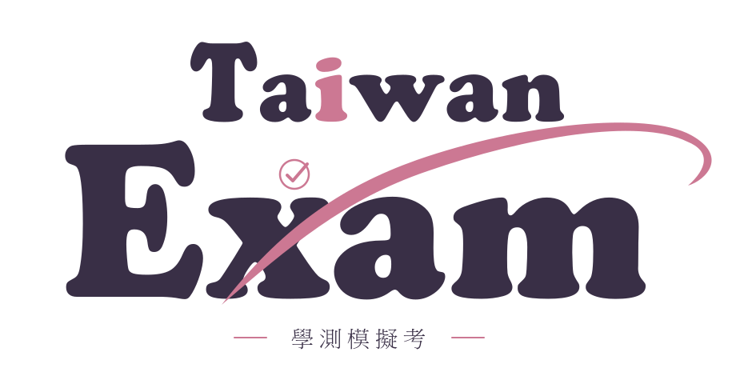

<div align="center">

<picture>
  <source media="(prefers-color-scheme: dark)" srcset="docs/assets/readme/wordmark-dark.svg">
  
</picture>

**讓 AI 幫你出一份原創的學測模擬考**<br>
命題、解題驗算、套用大考正式版面，最後交給你「題目 PDF」和「答案詳解 PDF」。

[](https://github.com/niansia/taiwan-exam/releases/download/hosted-2026.09.22.25/taiwan-exam-hosted-2026.09.22.25.zip)
[](#支援的考試與科目)
[](#claude)
[](#chatgpt)
[](#gemini)
[](LICENSE)

[**學測（目前可用）**](#支援的考試與科目) · [**會考（待製作）**](docs/exams/cap.md) · [**分科測驗（待製作）**](docs/exams/subject-test.md)

[**測試紀錄**](#模型實測紀錄) · [**下載安裝**](#第-1-步安裝) · [**開始出卷**](#第-3-步出卷) · [**版型預覽**](#七科版型預覽) · [**常見問題**](#卡住了怎麼辦) · [**更新紀錄**](docs/web-updates.md)

⭐ 覺得有幫助？登入 GitHub 後按頁面右上角的 <b>☆ Star</b>，讓更多老師和同學找到它
<a href="https://github.com/niansia/taiwan-exam/stargazers"></a>

</div>

---

## 這是什麼？

| ✍️ 原創命題 | 📐 正式版面 | ✅ 解題驗算 |
| :-- | :-- | :-- |
| 每次重新出題，不是現成題庫；依 108 課綱與近年大考題型、難度設計 | 封面、頁首、題組與選項排法都套用大考中心原始模板 | 每題重新解一次、檢查答案與難度，附完整答案詳解 |

**不用會寫程式，也不用註冊 GitHub。** 下載一個檔案、上傳到你用的 AI，之後每次貼一段話就能出卷。

| ① 下載 | ② 安裝 | ③ 出卷 | ④ 取得結果 |
| :-- | :-- | :-- | :-- |
| 選擇 Skill ZIP 或知識檔 | 上傳到你使用的 AI | 貼上科目與出卷需求 | 題目 PDF ＋ 答案詳解 PDF |
| [下載安裝](#第-1-步安裝) · 只做一次 | [選擇平台](#第-1-步安裝) · 只做一次 | [複製出卷文字](#第-3-步出卷) | [對照七科版型](#七科版型預覽) |

## 支援的考試與科目

| 考試 | 狀態 | 科目 |
| --- | --- | --- |
| **學測** | ✅ 可用 | 國綜、國寫、英文、數 A、數 B、自然、社會 |
| **[會考](docs/exams/cap.md)** | 待製作 · 已有基礎資料與流程，尚未提供網頁版 ZIP | 國文、英語、數學、自然、社會、寫作測驗 |
| **[分科測驗](docs/exams/subject-test.md)** | 待製作 · 規劃中 | 待整理 |

目前下方的安裝、出卷與實測紀錄皆以**學測七科**為主。會考、分科測驗可點進各自頁面查看製作狀態；推出時會在這裡和[更新紀錄](docs/web-updates.md)公告。

## 模型實測紀錄

預計用 **4 種模型各出一次學測七科，共 28 份完整模擬考**。以下是待填紀錄，尚未代表任何模型已通過測試。模型名稱依本輪測試規劃列出，實測時請填平台顯示的完整名稱。

**本輪預定版本：2026.09.22.25。** 每完成一科就更新一列，結果連結可指向該次的題目 PDF、答案詳解與檢查紀錄所在資料夾。

<details>
<summary><b>展開測試紀錄表：4 種模型 × 學測七科（28 筆）</b></summary>

| 使用的 LLM 模型 | 科目 | 訂閱方案 | Token／額度消耗 % | 生成時間 | 命題結果連結 |
| :-- | :-- | :-- | :-- | :-- | :-- |
| Claude Fable 5.1 | 國綜 | 待填 | 待填 | 待填 | 待測 |
| Claude Fable 5.1 | 國寫 | 待填 | 待填 | 待填 | 待測 |
| Claude Fable 5.1 | 英文 | 待填 | 待填 | 待填 | 待測 |
| Claude Fable 5.1 | 數 A | 待填 | 待填 | 待填 | 待測 |
| Claude Fable 5.1 | 數 B | 待填 | 待填 | 待填 | 待測 |
| Claude Fable 5.1 | 自然 | 待填 | 待填 | 待填 | 待測 |
| Claude Fable 5.1 | 社會 | 待填 | 待填 | 待填 | 待測 |
| Claude Opus 5.5 | 國綜 | 待填 | 待填 | 待填 | 待測 |
| Claude Opus 5.5 | 國寫 | 待填 | 待填 | 待填 | 待測 |
| Claude Opus 5.5 | 英文 | 待填 | 待填 | 待填 | 待測 |
| Claude Opus 5.5 | 數 A | 待填 | 待填 | 待填 | 待測 |
| Claude Opus 5.5 | 數 B | 待填 | 待填 | 待填 | 待測 |
| Claude Opus 5.5 | 自然 | 待填 | 待填 | 待填 | 待測 |
| Claude Opus 5.5 | 社會 | 待填 | 待填 | 待填 | 待測 |
| GPT 6 astra | 國綜 | 待填 | 待填 | 待填 | 待測 |
| GPT 6 astra | 國寫 | 待填 | 待填 | 待填 | 待測 |
| GPT 6 astra | 英文 | 待填 | 待填 | 待填 | 待測 |
| GPT 6 astra | 數 A | 待填 | 待填 | 待填 | 待測 |
| GPT 6 astra | 數 B | 待填 | 待填 | 待填 | 待測 |
| GPT 6 astra | 自然 | 待填 | 待填 | 待填 | 待測 |
| GPT 6 astra | 社會 | 待填 | 待填 | 待填 | 待測 |
| GPT 6 sol | 國綜 | 待填 | 待填 | 待填 | 待測 |
| GPT 6 sol | 國寫 | 待填 | 待填 | 待填 | 待測 |
| GPT 6 sol | 英文 | 待填 | 待填 | 待填 | 待測 |
| GPT 6 sol | 數 A | 待填 | 待填 | 待填 | 待測 |
| GPT 6 sol | 數 B | 待填 | 待填 | 待填 | 待測 |
| GPT 6 sol | 自然 | 待填 | 待填 | 待填 | 待測 |
| GPT 6 sol | 社會 | 待填 | 待填 | 待填 | 待測 |

</details>

<details>
<summary>填寫方式與計量說明</summary>

- **訂閱方案**：填當次實際方案；若使用模式或推理強度不同，也一併註明。
- **Token／額度消耗**：註明平台顯示的計量方式與時間窗。例如「5 小時額度：剩餘 80% → 65%，消耗 15 個百分點」。平台若未提供，填「未提供」，不要估算成 Token 數；不同平台的百分比不直接互相比較。
- **生成時間**：從送出需求到取得兩份最終 PDF 的總時間，包含中途接續，格式如「32 分 10 秒」。
- **命題結果連結**：將「待測」改成 `[查看結果](實際網址)`；未完成也照實記錄，可用 `[未完成：原因](實際網址)`。檢查紀錄可附測試日期、實際版本及答案／版面問題。

</details>

## 第 1 步：安裝

找到你用的 AI，只看那一列。畫面若是中文，請找意思相同的按鈕。

| 你用的 AI | 下載 | 安裝說明 |
| --- | --- | --- |
| **Claude**（claude.ai） | [⬇ Skill ZIP](https://github.com/niansia/taiwan-exam/releases/download/hosted-2026.09.22.25/taiwan-exam-hosted-2026.09.22.25.zip) | [看 Claude](#claude) |
| **ChatGPT**（左側欄有 Plugins → Skills） | [⬇ Skill ZIP](https://github.com/niansia/taiwan-exam/releases/download/hosted-2026.09.22.25/taiwan-exam-hosted-2026.09.22.25.zip) | [看 ChatGPT](#chatgpt) |
| **ChatGPT**（找不到 Skills） | [⬇ 直接下載網頁版知識檔](https://niansia.github.io/taiwan-exam/download-web-knowledge.html) | [看 ChatGPT 專案](#chatgpt) |
| **Gemini** | [⬇ 直接下載網頁版知識檔](https://niansia.github.io/taiwan-exam/download-web-knowledge.html) | [看 Gemini](#gemini) |
| Codex、Claude Code、Gemini CLI | 不用下載 | [看本機版](#進階本機版) |

> [!TIP]
> 點連結會直接下載到電腦的「**下載**」資料夾。**ZIP 不要解壓縮**，上傳時直接選整個 ZIP。知識檔 `taiwan-exam-web-knowledge.md` 是一般文字檔，不是程式。

### Claude

1. 下載 [Skill ZIP](https://github.com/niansia/taiwan-exam/releases/download/hosted-2026.09.22.25/taiwan-exam-hosted-2026.09.22.25.zip)，不要解壓縮。
2. 開啟 [Claude](https://claude.ai/)，依序點 **Customize → Skills → ＋ → Create skill → Upload a skill**。
3. 選剛下載的 `taiwan-exam-hosted-2026.09.22.25.zip`，按 **Save**。
4. 確認技能清單出現 `taiwan-exam-generator`，而且已開啟。
5. 到 **Settings → Capabilities**，確認 **Code execution and file creation** 已開啟（學校或公司帳號可能由管理員控制）。

完成後**跳過第 2 步，直接看[第 3 步](#第-3-步出卷)**，出卷時不必附任何檔案。出卷時可在輸入框打 `/` 選 `taiwan-exam-generator`，也可以直接貼上出卷文字，Claude 會自動套用。一般對話（Chat）和 **Cowork** 都能使用；Claude for Word 外掛尚未驗證，請先不要用。

<details>
<summary>找不到 Skills？改用 Claude 專案</summary>

1. 下載[知識檔](https://niansia.github.io/taiwan-exam/download-web-knowledge.html)。
2. 在 Claude 左側點 **Projects**，建立專案，名稱填 `Taiwan Exam`。
3. 在專案的 **Project knowledge** 上傳 `taiwan-exam-web-knowledge.md`。
4. 在 **Project instructions** 貼上下面這段並儲存：

   ```text
   本 Project 一律依 Knowledge 中的 Taiwan Exam Skill 規則出題。
   完整考卷須分開交付題目 PDF 與答案詳解 PDF，完成解題與逐頁版面檢查。
   封面、頁首頁尾與公式頁一律套用原始模板，不可自行重畫；無法套用時先停下來告訴我，其他情況不要中途停下來回報進度。
   ```

以後出卷都在這個專案裡開新對話，並照[第 2 步](#第-2-步準備檔案只有專案或-gem-需要)附上檔案。

</details>

### ChatGPT

**有 Skills 的帳號：直接上傳 ZIP（建議）**

依 [OpenAI 官方說明](https://help.openai.com/en/articles/20001066-skills-in-chatgpt)，Skills 目前開放給 Business、Enterprise、Healthcare、Edu 帳號，工作區管理員也可能關閉上傳。一般 Free、Plus、Pro 帳號請看下面的「沒有 Skills」。

1. 下載 [Skill ZIP](https://github.com/niansia/taiwan-exam/releases/download/hosted-2026.09.22.25/taiwan-exam-hosted-2026.09.22.25.zip)，不要解壓縮。
2. 開啟 [ChatGPT](https://chatgpt.com/)，在左側欄點 **Plugins**，再點上方的 **Skills** 分頁。
3. 點 **Create → Upload from your computer**，選剛下載的 ZIP。
4. 等 ChatGPT 掃描完成，技能清單出現 `taiwan-exam-generator` 就完成了。

完成後**跳過第 2 步，直接看[第 3 步](#第-3-步出卷)**，出卷時不必附任何檔案。出卷時在輸入框打 `@` 選 `taiwan-exam-generator`，再貼上出卷文字。

掃描結果若是 **Needs Review**，請看完畫面說明再決定是否使用；若是 **Blocked** 就無法使用，請改用下面的專案方式。

<details>
<summary>沒有 Skills 的帳號：建立專案</summary>

1. 下載[知識檔](https://niansia.github.io/taiwan-exam/download-web-knowledge.html)。
2. 在 ChatGPT 左側欄點 **Projects**，新增專案，名稱填 `Taiwan Exam`。
3. 在專案裡上傳 `taiwan-exam-web-knowledge.md`。
4. 打開專案的 **Instructions**，貼上下面這段並儲存：

   ```text
   這個專案的所有出卷需求，都依我上傳的 Taiwan Exam 知識檔規則執行。
   完整考卷要完成解題與逐頁版面檢查，分開提供題目 PDF 和答案詳解 PDF。
   封面、頁首頁尾與公式頁一律套用原始模板，不可自行重畫；無法套用時先停下來告訴我，其他情況不要中途停下來回報進度。
   ```

以後出卷都在這個專案裡開新對話，並照[第 2 步](#第-2-步準備檔案只有專案或-gem-需要)附上檔案。

</details>

### Gemini

1. 下載[知識檔](https://niansia.github.io/taiwan-exam/download-web-knowledge.html)。
2. 開啟 [Gemini](https://gemini.google.com/)，在左側找到 **Gems**，建立新的 Gem，名稱填 `Taiwan Exam`。
3. 在 **Knowledge（知識）** 上傳 `taiwan-exam-web-knowledge.md`。
4. 在 **Instructions（指示）** 貼上下面這段，按 **Save（儲存）**：

   ```text
   採用 Knowledge 中的 Taiwan Exam Skill 全部規則出題。
   完整考卷須分開交付題目 PDF 與答案詳解 PDF，完成解題與逐頁版面檢查。
   封面、頁首頁尾與公式頁一律套用原始模板，不可自行重畫；無法套用時先停下來告訴我，其他情況不要中途停下來回報進度。
   ```

以後出卷都開這個 Gem，並照[第 2 步](#第-2-步準備檔案只有專案或-gem-需要)附上檔案。

## 第 2 步：準備檔案（只有專案或 Gem 需要）

> [!NOTE]
> **用 Skill ZIP 的人（Claude、有 Skills 的 ChatGPT）跳過這一步。** 七科版型和原始模板都已內建在 ZIP 裡。

用專案或 Gem（知識檔）的人，每個科目準備一次：

1. 開啟[七科版型下載頁](https://niansia.github.io/taiwan-exam/layout-examples/2026.09.22.25/index.html)，找到要出的科目，分別按「**下載題本版型**」和「**下載詳解版型**」。
2. 下載[離線模板資源 PDF](https://niansia.github.io/taiwan-exam/download-web-knowledge.html#templates)（七科共用一份）。
3. 出卷時把這 3 份檔案一起附上。

版型 PDF 讓 AI 知道這一科正式考卷長什麼樣子，裡面都是占位文字，AI 只參考排版、不會照抄；離線模板資源 PDF 讓 AI 不必連網就能套用原始模板。

## 第 3 步：出卷

1. **開一個新對話。**
   - 已上傳 Skill：直接開新對話，不用附檔案。**Claude** 在輸入框打 `/`、**ChatGPT** 打 `@`，選 `taiwan-exam-generator`。
   - 用專案或 Gem：先進入 `Taiwan Exam` 專案或 Gem，再開新對話，按「**＋**」或迴紋針附上[第 2 步](#第-2-步準備檔案只有專案或-gem-需要)的 3 份檔案。
2. **複製下面這段，貼上並送出。** 把「數 A」換成你要的科目：

   ```text
   請依 Taiwan Exam Skill 出一份 116 學測數 A 完整模擬考。
   封面、頁首頁尾與公式頁必須直接套用原始模板，不可自行重畫或改用 LaTeX 排版。
   版型只供對照，題目、圖形與解答都要重新設計。
   完成解題、逐頁版面檢查與最終檢查，分開交付題目 PDF 與答案詳解 PDF，並告訴我最終檢查結果。
   過程中不要停下來回報進度，一路做到交付兩份 PDF。
   如果無法套用原始模板，請先停下來告訴我缺少什麼，不要交付自己畫的版本。
   ```

3. **下載兩份 PDF**，再對照[版型](#七科版型預覽)看一下封面是否一致。

| 想要 | 怎麼改 |
| --- | --- |
| 換科目 | 「數 A」改成國綜、英文、數 B、自然、社會或國寫 |
| 只出幾題練習 | 改成「請出 5 題學測數 A 自訂練習」，通常一輪就完成 |
| 完整考卷 | 通常要 2～3 輪；AI 停在存檔點時，在同一個對話回「繼續」即可 |
| 指定題材入題 | 在出卷文字最後加一句，例如「請把中秋節融入至少一個題組，其餘照常命題。」 |
| 調整難度 | 在出卷文字最後加一句，例如「數 A 難題占 40%。」各科目前設定見下方 |

<details>
<summary><b>想把特定題材放進考卷？（中秋節、最近的颱風、某則新聞…）</b></summary>

在上面那段出卷文字的**最後**，再加一行你想要的題材，其餘照常送出。例如：

```text
請把「中秋節」融入至少一個題組（例如月相、節慶習俗或消費統計），其餘題目照常命題。
```

```text
請以「今年 8 月的颱風」為其中一組題的情境，並查證氣象署公布的資料。
```

```text
請參考這則新聞出一組題：https://（貼上新聞網址）
```

- 題材只當作情境，題目仍然會依課綱命題、查證事實，並符合正式考卷的題型與難度。
- 一次指定 1～2 個題材最適合；指定太多會壓縮其他單元，AI 可能只用得上其中幾個。
- 附上新聞或資料的網址，AI 查證會更準確。

</details>

<details>
<summary><b>各科目前的難度設定，以及怎麼自訂難度</b></summary>

目前各科都照**學測原始設定**出題，數字依官方 111～115 年的答對率校準。每一項都有可接受的範圍：落在範圍內就算完成，AI 不會為了差一點點反覆重新審題。

| 科目 | 目前設定 | 可接受範圍 |
| --- | --- | --- |
| 數 A、數 B | 滿分 100 分中，中偏難＋難占 70 分、難占 30 分；簡單低於 10 分；手算約 80～92 分鐘 | 分數 ±3（中偏難＋難 67 分、難 27 分以上）；時間 ±5（75～97 分鐘） |
| 國綜 | 平均答對率不高於 0.62（官方 0.48～0.58） | 到 0.65 |
| 自然 | 選擇題平均答對率不高於 0.65（官方 0.53～0.57） | 到 0.68 |
| 社會 | 選擇題平均答對率不高於 0.65（官方 0.51～0.60） | 到 0.68 |
| 英文 | 詞彙題至少 5 題中偏難或難；克漏字、文意選填、篇章結構至少 12 題要跨句判斷；閱讀至少 8 題要跨句或跨段推論 | 各少 1 題 |
| 國寫 | 照官方題型與評分原則，沒有數字難度 | — |

難度依 AI 審題時預估的答對率分級：**難**低於 0.30、**中偏難** 0.30～0.50、**中** 0.50～0.70、**簡單** 0.70 以上。

**想自訂難度**：在出卷文字的**最後**加一句，例如：

```text
數 A 難題占 40%。
```

```text
數 B 中偏難加難占 60%，難題占 20%。
```

```text
自然平均答對率 0.5，難題占 20%。
```

- 數 A、數 B 的「占幾 %」指 100 分中的分數，接受 ±3 分。
- 國綜、自然、社會可以指定平均答對率（接受 ±0.03）或難題比例（難題占題數的百分比，接受 ±5 個百分點）。
- 英文、國寫可以寫要求，AI 會照著調整出題方向，但檢查的數字不會改。
- 沒有寫的項目，照學測原始設定。

</details>

> [!WARNING]
> 目前的難度就是學測原始設定。考卷做起來偏難是正常的，**不建議因為覺得太難就自己調簡單**：調簡單後，考卷就不再反映學測的真實程度，練習效果也會打折。

> [!TIP]
> ChatGPT 剛上傳完 Skill 時，輸入框可能自動出現一段英文（I just added the … skill）。先刪掉再貼出卷文字，免得 AI 先做示範。ChatGPT 若有 **Work** 模式，完整考卷建議在 Work 模式出。

## 七科版型預覽

每科都有「題本」和「詳解」兩份版型，可以用來對照 AI 交付的考卷。Skill ZIP 已內建全部版型。

| 科目 | 題本 | 詳解 | 科目 | 題本 | 詳解 |
| --- | :-: | :-: | --- | :-: | :-: |
| 國綜 | [開啟](https://niansia.github.io/taiwan-exam/layout-examples/2026.09.22.25/chinese-questions.pdf) | [開啟](https://niansia.github.io/taiwan-exam/layout-examples/2026.09.22.25/chinese-solutions.pdf) | 自然 | [開啟](https://niansia.github.io/taiwan-exam/layout-examples/2026.09.22.25/science-questions.pdf) | [開啟](https://niansia.github.io/taiwan-exam/layout-examples/2026.09.22.25/science-solutions.pdf) |
| 英文 | [開啟](https://niansia.github.io/taiwan-exam/layout-examples/2026.09.22.25/english-questions.pdf) | [開啟](https://niansia.github.io/taiwan-exam/layout-examples/2026.09.22.25/english-solutions.pdf) | 社會 | [開啟](https://niansia.github.io/taiwan-exam/layout-examples/2026.09.22.25/social-questions.pdf) | [開啟](https://niansia.github.io/taiwan-exam/layout-examples/2026.09.22.25/social-solutions.pdf) |
| 數 A | [開啟](https://niansia.github.io/taiwan-exam/layout-examples/2026.09.22.25/math-a-questions.pdf) | [開啟](https://niansia.github.io/taiwan-exam/layout-examples/2026.09.22.25/math-a-solutions.pdf) | 國寫 | [開啟](https://niansia.github.io/taiwan-exam/layout-examples/2026.09.22.25/writing-questions.pdf) | [開啟](https://niansia.github.io/taiwan-exam/layout-examples/2026.09.22.25/writing-solutions.pdf) |
| 數 B | [開啟](https://niansia.github.io/taiwan-exam/layout-examples/2026.09.22.25/math-b-questions.pdf) | [開啟](https://niansia.github.io/taiwan-exam/layout-examples/2026.09.22.25/math-b-solutions.pdf) | | | |

版型只含占位內容，供排版參考，不能照抄題目、題號、配分或留白。也可以到[七科版型下載頁](https://niansia.github.io/taiwan-exam/layout-examples/2026.09.22.25/index.html)一次看完。

## 卡住了怎麼辦？

<details>
<summary><b>AI 沒給 PDF、說「尚未完成」、中途逾時或停住</b></summary>

留在**同一個對話**。畫面有 **Continue／繼續** 就按它，沒有就輸入：

```text
繼續完成
```

也可以貼上這段，說得更清楚：

```text
請接續剛才的考卷，完成剩餘的命題、解題、排版與檢查，再交付題目 PDF 和答案詳解 PDF，不要重新開始。
過程中不要停下來回報進度，一路做到交付兩份 PDF。
```

如果 AI 說先前的檔案不見了，再依提示重新附上檔案。

</details>

<details>
<summary><b>封面、頁首跟版型不一樣，看起來是 AI 自己重畫的</b></summary>

正確的考卷，封面和每頁頁首會和[版型](#七科版型預覽)一模一樣：字型、作答注意事項、劃記範例、頁首位置都相同，只有年份、考試名稱和頁碼不同。明顯不一樣就代表 AI 沒有套用原始模板，這份不能用。請在同一個對話貼上：

```text
這份 PDF 沒有套用原始模板，是自行重畫的版本，不能使用。
請改用 Taiwan Exam Skill 內附的原始模板與工具重新組版，最後執行最終檢查並告訴我結果。
已寫好的題目可以沿用，但要依 Skill 流程補齊解題驗證與版面檢查。
封面、頁首頁尾與公式頁一律使用原始模板，不可用 LaTeX、HTML 或 Word 重畫。
如果還是無法套用，請說明缺少什麼。
```

用專案或 Gem 的人，再附上[離線模板資源 PDF](https://niansia.github.io/taiwan-exam/download-web-knowledge.html#templates) 一起送出。

</details>

<details>
<summary><b>AI 說無法下載或套用模板</b></summary>

2026.09.18.1 以後的 Skill ZIP 已內建模板；若仍出現這個訊息，先確認技能已換成新版。用專案或 Gem 的人請照下面做：

1. 點[下載離線模板資源 PDF](https://niansia.github.io/taiwan-exam/download-web-knowledge.html#templates)。
2. 回到**原本出卷的對話**，上傳 `taiwan-exam-template-resources.pdf`。
3. 貼上下面這段（科目自行替換）：

   ```text
   這是離線模板資源 PDF，請用它處理這份數 A 考卷的固定模板。
   請讀取 PDF 內附的原始模板附件，不要只讀可見首頁；只取用本次科目的檔案。
   依 Taiwan Exam 規則核對後，使用原始 PDF 套版，保留固定封面、頁首尾及公式頁。
   請接續目前這份考卷，修正排版並重新檢查，分開提供題目 PDF 與答案詳解 PDF。
   如果仍無法處理附件或套版，請明確說明缺少哪個功能及已保存的進度。
   ```

這份約 3.5 MB 的 PDF 已內附原始模板，打開只看到說明首頁是正常的。如果 AI 的環境不能讀取附件或合併 PDF，補傳檔案也沒有用，要換到有這些功能的模式或平台。

</details>

<details>
<summary><b>AI 說缺少繁體中文字型</b></summary>

2026.09.19.3 以後的 Skill 會自動改用內建字型繼續，不會停下來。如果 AI 還是停下來要字型，在同一個對話貼上：

```text
不用等我提供字型：請改用 PyMuPDF 內建的中文字型繼續。
用 python 把 pymupdf.Font('cjk').buffer 存成字型檔，再用 --font 指向它重新執行預檢；之後的 proof、build 都用同一個字型檔。
其餘規則不變：封面、頁首頁尾與公式頁一律套用原始模板，完成最終檢查後再交付。
```

</details>

<details>
<summary><b>模板有套用，但題目壓字、選項跑位</b></summary>

在同一個對話貼上下面這段（用專案或 Gem 的人再附上當科版型 PDF）：

```text
請依 Taiwan Exam Skill 的流程修正目前考卷的題幹、選項、作答欄與圖表排版：改存檔的題目或排版提示，再用內附工具重新組版。
版型只供對照，占位文字不可作為題目，也不要照抄示範的題號、配分或留白。
請保留原始固定模板，重新檢查修正後兩份 PDF 的每一頁，完成最終檢查後再提供下載。
```

</details>

<details>
<summary><b>AI 說「執行環境缺少 PyMuPDF，且無法安裝」</b></summary>

Skill 會自己從本專案的 GitHub Release 下載並驗證 PyMuPDF，通常不需要你做任何事。只有連 github.com 也被擋時，AI 才會請你：

1. 下載 [pymupdf-1.26.0-cp39-abi3-manylinux2014_x86_64.manylinux_2_17_x86_64.whl](https://github.com/niansia/taiwan-exam/releases/download/wheels-pymupdf-1.26.0/pymupdf-1.26.0-cp39-abi3-manylinux2014_x86_64.manylinux_2_17_x86_64.whl)。
2. 把這個檔案直接上傳到同一個出卷對話，回「繼續」。

仍失敗時，請把 AI 印出的 JSON 貼到[回報問題](https://github.com/niansia/taiwan-exam/issues)。

</details>

<details>
<summary><b>AI 說無法下載照片（Download failed、照片庫逾時）</b></summary>

自然、社會、英文的完整考卷至少要有一張有來源的真實照片。有時當次對話的執行環境連不上外部網站，AI 看得到照片卻存不下來（常見於 ChatGPT 網頁版）。

1. **刪掉目前這個對話，開一個新的對話重新出卷**，大多就能恢復。
2. 還是不行時，自己上傳照片：把一張和題目相關、知道出處的照片（例如自己拍的，或從政府開放資料、Wikimedia Commons 下載的）上傳到同一個出卷對話，註明出處後回「繼續」。也可以下載 Skill 的[照片庫 ZIP](https://github.com/niansia/taiwan-exam/releases/download/photos-v1/taiwan-exam-photo-library-v1.zip)（約 15 MB）上傳，AI 會自己挑選合適的照片。
3. 或改用 **ChatGPT 桌面版**出卷。

截圖不能當作原始照片，請上傳照片檔本身。

</details>

<details>
<summary><b>上傳 ZIP 出現「too many files」或「path with invalid characters」</b></summary>

這是舊版 ZIP 的問題（2026.09.22.1～.3 超過 Claude 的 200 個檔案上限；2026.09.14.1 有路徑字元問題）。請重新下載[新版 Skill ZIP](https://github.com/niansia/taiwan-exam/releases/download/hosted-2026.09.22.25/taiwan-exam-hosted-2026.09.22.25.zip) 再上傳，不需要自己解壓或修改。若新版仍被拒收，請保留錯誤文字並[回報問題](https://github.com/niansia/taiwan-exam/issues)。

</details>

<details>
<summary><b>ChatGPT 有 Skills，但沒有 Upload from your computer</b></summary>

上傳功能可能被工作區管理員關閉。可以在對話輸入框打 `@skill-creator` 並選取它，附上 Skill ZIP，再貼上：

```text
請使用我附上的 Taiwan Exam Skill ZIP 建立 taiwan-exam-generator Skill。
請完整保留 SKILL.md、scripts、references、schemas，不要合併、改寫或另寫一套出題器。
完成後直接在本對話接受出卷需求。
```

若也找不到 `@skill-creator`，請改用 [ChatGPT](#chatgpt) 的專案方式。

</details>

<details>
<summary><b>找不到 Skills、Projects 或 Gems</b></summary>

各平台依帳號方案開放的功能不同，以你的畫面為準。都找不到時，可以在一般對話附上知識檔、2 份版型 PDF 和[離線模板資源 PDF](https://niansia.github.io/taiwan-exam/download-web-knowledge.html#templates)，再貼上出卷文字；換新對話時要重新上傳。AI 的環境也需要能建立與檢查 PDF。

</details>

<details>
<summary><b>進階：讓專案或 Gem 的對話直接使用 ZIP 裡的工具</b></summary>

如果出卷對話能執行 Python、讀寫檔案，可以額外附上 [Skill ZIP](https://github.com/niansia/taiwan-exam/releases/download/hosted-2026.09.22.25/taiwan-exam-hosted-2026.09.22.25.zip)，並加上這段：

```text
我已附上 Taiwan Exam 網頁工具 ZIP，請解壓到本次工作目錄，依內附 hosted-execution 流程執行。
直接使用內附的載入、排版與檢查工具，只讀本次科目所需資料，不要重新撰寫整套工具。
題目、圖表與解答仍須原創；若接續先前考卷，請沿用已保存進度。
```

</details>

## 更新到新版

**目前版本：Skill ZIP 與知識檔皆為 2026.09.22.25，七科版型 2026.09.22.25。** [看更新紀錄](docs/web-updates.md)

GitHub 有新版時，你帳號裡的檔案**不會自動更新**：

| 你用的方式 | 怎麼更新 |
| --- | --- |
| Claude、ChatGPT 的 Skill | 停用或移除舊的 `taiwan-exam-generator`，再依[第 1 步](#第-1-步安裝)上傳新版 ZIP |
| 專案或 Gem | 刪掉舊的 `taiwan-exam-web-knowledge.md`，上傳重新下載的知識檔 |
| 版型 PDF | 版本沒變就不用重新下載 |

換好之後請**開一個新對話**再出卷，舊對話仍會沿用舊版。

## 進階：本機版

<details>
<summary>已經在用 Codex、Claude Code 或 Gemini CLI 的人看這裡</summary>

不熟悉終端機請用上面的網頁版。下面的安裝文字是**貼給 AI 執行**的，不用自己搬檔案。

**Codex 桌面版／CLI**：在聊天框貼上

```text
$skill-installer
請從 https://github.com/niansia/taiwan-exam 安裝 taiwan-exam-generator 為使用者層級 Skill。
先讀 INSTALL.md 並完成驗證；請保留我的私人考試資料與自訂模板。
```

**Claude Code 桌面版／CLI**：在聊天框貼上

```text
請從 https://github.com/niansia/taiwan-exam 取得完整原始碼，先讀 INSTALL.md，
再安裝 taiwan-exam-generator 為使用者層級 Skill 並驗證。
請保留我的私人考試資料與自訂模板。
```

**Gemini CLI**：在終端機執行

```sh
gemini skills install https://github.com/niansia/taiwan-exam
```

安裝好之後，選取 `taiwan-exam-generator`（Codex 打 `$`、Claude Code 打 `/`），再貼上[第 3 步](#第-3-步出卷)的出卷文字。安裝與更新細節見 [INSTALL.md](INSTALL.md)。

</details>

## 進一步閱讀

| 文件 | 內容 |
| --- | --- |
| [SKILL.md](SKILL.md) | 命題與交付規則入口 |
| [各平台使用指引](docs/usage-guide.md) | 網頁、CLI、桌面版的操作範例 |
| [更新紀錄](docs/web-updates.md) | 每一版比對官方考卷後的修正 |
| [來源資料與維護](docs/sources-and-maintenance.md) | 歷屆資料取得、執行環境、測試與發布 |
| [參與指南](CONTRIBUTING.md) | 回報問題、提出建議與提交 PR 的方式 |

## 一起參與

這個專案是公開的，歡迎一起讓它更好，不會寫程式也能參與（回報與建議需要免費的 GitHub 帳號）：

| 想做的事 | 怎麼做 |
| --- | --- |
| 🐞 回報問題 | 出卷失敗、排版錯、答案有誤，到 [Issues](https://github.com/niansia/taiwan-exam/issues/new/choose) 選「出卷問題」，附上平台、版本、科目和截圖 |
| 💡 提出建議 | 想要新科目、新考試或更好的說明，選「功能建議」 |
| 🛠️ 修改程式或文件 | Fork 後發 Pull Request，**所有 PR 都由維護者審核後才會合併**；流程見 [CONTRIBUTING.md](CONTRIBUTING.md) |
| ⭐ 支持專案 | 登入 GitHub 後按右上角 **☆ Star**，讓更多老師和同學找到它 |

回報或貢獻時，請不要上傳大考中心或出版社的完整試卷、個人資料或帳號資訊。

## 授權

本專案不是大考中心、心測中心、OpenAI、Anthropic 或 Google 的官方產品。

自有程式與文件採 [MIT License](LICENSE)；著作權、來源與改作要求見 [NOTICE](NOTICE)、[ORIGIN.json](ORIGIN.json) 及[改作說明](references/attribution-and-forks.md)。MIT 不替第三方試卷、文章、圖片、資料或字型授權。

<div align="center"><sub>覺得 Taiwan Exam 有幫助？按右上角 ☆ <b>Star</b> 支持一下 ⭐</sub></div>
